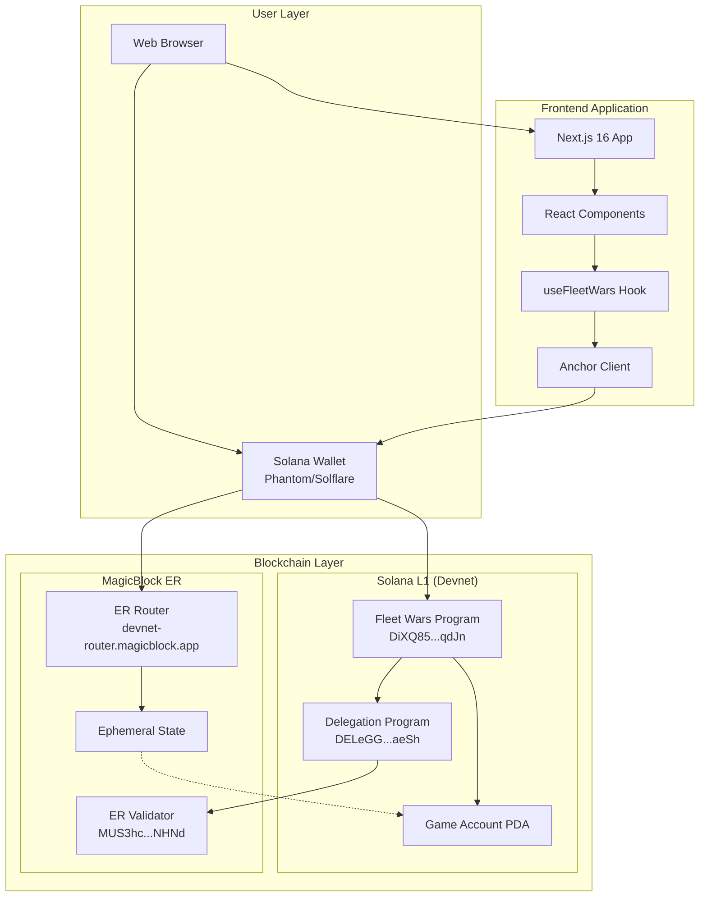
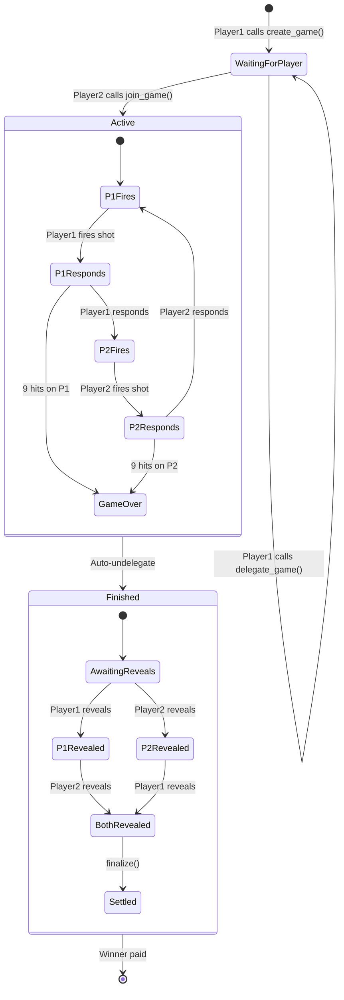
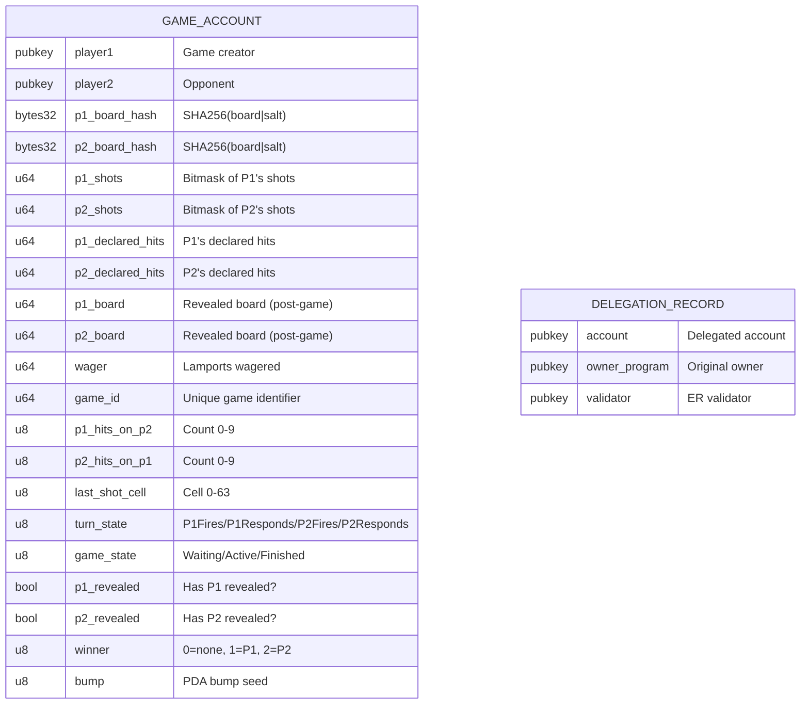
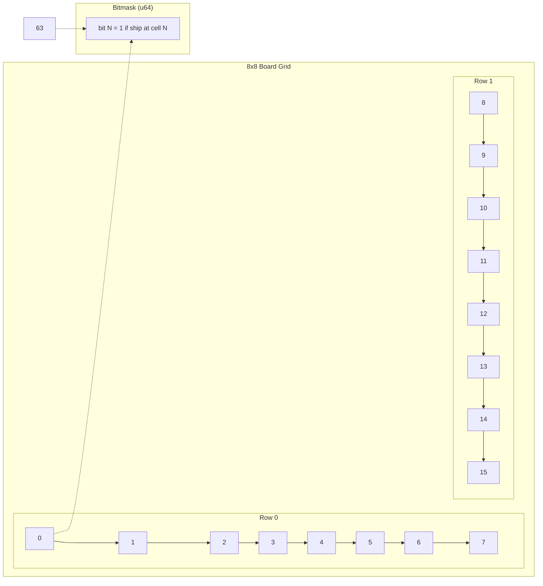
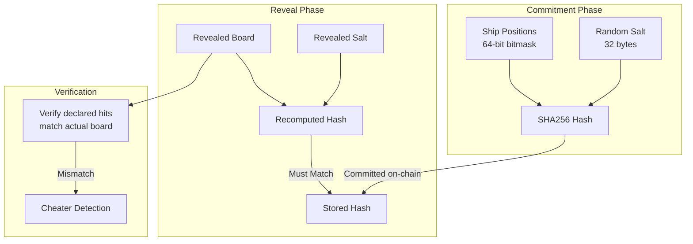
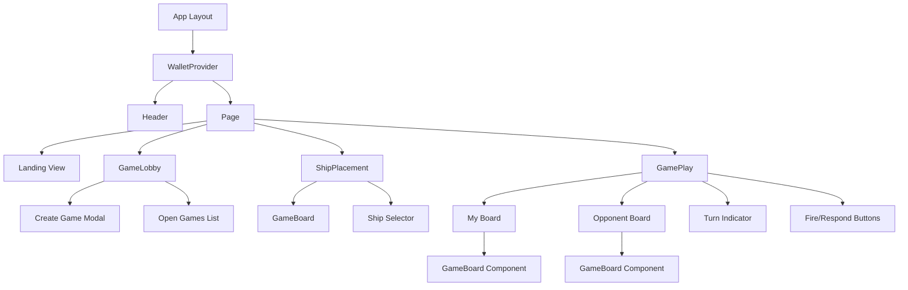

# Fleet Wars Architecture

## System Overview



## Game State Machine



## Data Flow

```mermaid
sequenceDiagram
    actor P1 as Player 1
    actor P2 as Player 2
    participant FE as Frontend
    participant L1 as Solana L1
    participant DP as Delegation Program
    participant ER as Ephemeral Rollup

    rect rgb(40, 40, 60)
        Note over P1,L1: Phase 1: Game Creation (L1)
        P1->>FE: Place ships on board
        FE->>FE: Generate salt, compute hash
        FE->>L1: create_game(hash, wager)
        L1->>L1: Create Game PDA
        L1-->>FE: Game created ✓
        
        FE->>DP: delegate_game()
        DP->>DP: Create delegation records
        DP-->>FE: Delegated ✓
    end

    rect rgb(40, 60, 40)
        Note over P2,L1: Phase 1: Join Game (L1)
        P2->>FE: Place ships on board
        FE->>FE: Generate salt, compute hash
        FE->>L1: join_game(hash)
        L1->>L1: Update Game PDA
        L1-->>FE: Joined ✓
    end

    rect rgb(60, 40, 40)
        Note over P1,ER: Phase 2: Battle (ER)
        ER->>ER: Clone state from L1
        
        loop Until game ends
            P1->>FE: Click cell to fire
            FE->>ER: fire_shot(cell)
            ER-->>FE: Shot registered
            
            P2->>FE: Declare hit/miss
            FE->>ER: respond_shot(hit)
            ER-->>FE: Response recorded
            
            P2->>FE: Click cell to fire
            FE->>ER: fire_shot(cell)
            ER-->>FE: Shot registered
            
            P1->>FE: Declare hit/miss
            FE->>ER: respond_shot(hit)
            ER-->>FE: Response recorded
        end
        
        ER->>ER: Auto-commit & undelegate
        ER->>L1: State committed
    end

    rect rgb(40, 40, 60)
        Note over P1,L1: Phase 3: Settlement (L1)
        P1->>FE: Reveal board
        FE->>L1: reveal_board(board, salt)
        L1->>L1: Verify hash matches
        
        P2->>FE: Reveal board
        FE->>L1: reveal_board(board, salt)
        L1->>L1: Verify hash matches
        
        P1->>FE: Finalize game
        FE->>L1: finalize()
        L1->>L1: Verify hits, determine winner
        L1->>L1: Transfer wager to winner
        L1-->>FE: Game complete ✓
    end
```



## Account Structure



## Board Representation



**Example Board:**
```
Board: 0b0000_0001_1100_0111_0000_0000_...
       = Ships at cells 0,1,2,6,7,8 (6 cells shown)

Cell Index:
 0  1  2  3  4  5  6  7
 8  9 10 11 12 13 14 15
16 17 18 19 20 21 22 23
24 25 26 27 28 29 30 31
32 33 34 35 36 37 38 39
40 41 42 43 44 45 46 47
48 49 50 51 52 53 54 55
56 57 58 59 60 61 62 63
```

## Security Model



## Frontend Component Tree



## Technology Stack

| Layer | Technology |
|-------|------------|
| Frontend Framework | Next.js 16 (App Router) |
| UI Library | React 19 |
| Styling | TailwindCSS 4 |
| Animations | Framer Motion |
| Icons | Lucide React |
| Blockchain | Solana (Devnet) |
| Smart Contracts | Anchor 0.30.1 |
| Ephemeral Rollups | MagicBlock SDK |
| Wallet Connection | Solana Wallet Adapter |
| Type Safety | TypeScript 5 |
