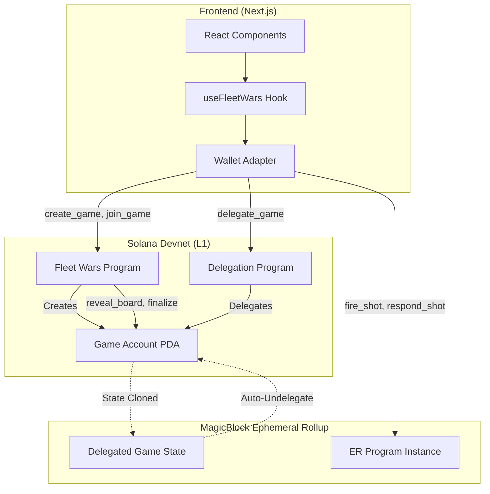
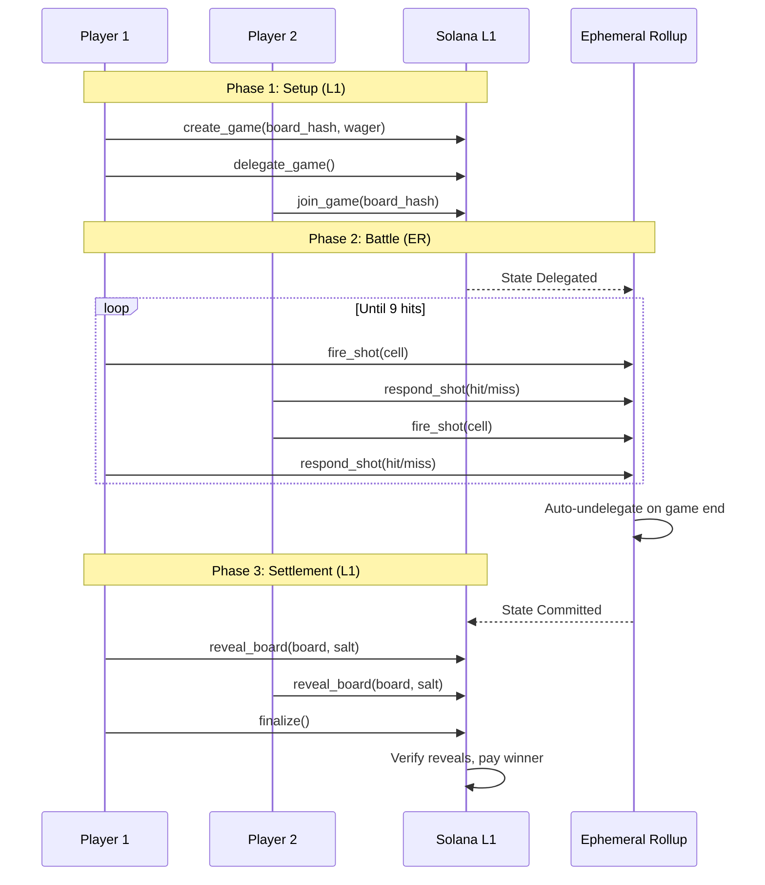
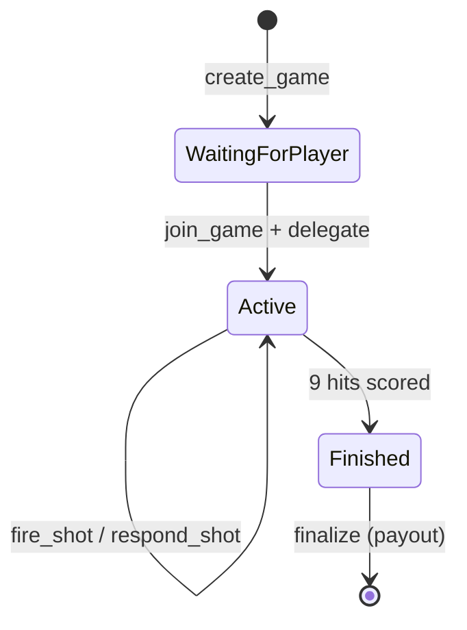

# ⚓ Fleet Wars

**Real-time naval combat on Solana, powered by MagicBlock Ephemeral Rollups**

> 🏆 **Built for the [Matrix Hackathon](https://matrix.playsolana.com) by PlaySolana**  
> 🎮 **Track: Solana On-Chain & Real-Time Gaming by MagicBlock**

Fleet Wars is a fully on-chain battleship-style game that leverages MagicBlock's Ephemeral Rollups (ER) for sub-second transaction speeds during gameplay, while maintaining the security guarantees of Solana's base layer for game creation, settlements, and wager payouts.


---

## 🎮 Game Description

Fleet Wars brings the classic naval combat experience to the blockchain with a modern twist. Two players compete in strategic warfare, deploying their fleets on an 8x8 grid and taking turns to locate and destroy enemy ships.

### How It Works

1. **Create or Join a Battle**: Player 1 creates a game with an optional SOL wager, commits their board configuration (hashed for privacy), and waits for an opponent.

2. **Deploy Your Fleet**: Each player strategically places 9 ship cells on their 8x8 board. The board configuration is cryptographically committed using SHA-256, ensuring no one can see your setup.

3. **Delegate to Ephemeral Rollup**: Once both players join, the game state is delegated to MagicBlock's Ephemeral Rollup for lightning-fast gameplay.

4. **Battle Phase**: Players alternate firing shots and responding with hit/miss declarations. All moves execute in sub-second time on the ER.

5. **Victory & Settlement**: When all 9 enemy ships are sunk, the game auto-undelegates back to Solana L1. Players reveal their boards to prove honesty, and the winner claims the pot.

### Key Features

- **🚀 Lightning Fast**: Sub-second transactions during gameplay via MagicBlock Ephemeral Rollups
- **🔒 Trustless**: Cryptographic commitments prevent cheating; reveals are verified on-chain
- **💰 Wagering**: Optional SOL wagers with automatic winner payout
- **🎨 Cyberpunk UI**: Modern, responsive interface with neon aesthetics
- **📱 Wallet Integration**: Seamless connection with Phantom, Solflare, and other Solana wallets
- **🎖️ NFT Ship Skins**: Collectible ship designs as Metaplex Core NFTs with rarity tiers

## 🏗️ Architecture



### Game Flow



### State Machine



## 📁 Project Structure

```
fleet-wars/
├── programs/
│   └── fleet-wars/
│       └── src/
│           ├── lib.rs              # Program entry point with #[ephemeral] macro
│           ├── state.rs            # Game account structure
│           ├── error.rs            # Custom error types
│           └── instructions/
│               ├── create_game.rs  # L1: Create game with board commitment
│               ├── join_game.rs    # L1: Join existing game
│               ├── delegate_game.rs# L1: Delegate to MagicBlock ER
│               ├── fire_shot.rs    # ER: Fire at opponent's board
│               ├── respond_shot.rs # ER: Declare hit/miss
│               ├── end_session.rs  # ER: Manual undelegation
│               ├── reveal_board.rs # L1: Reveal board for verification
│               └── finalize.rs     # L1: Verify and pay winner
├── app/
│   └── src/
│       ├── app/                    # Next.js app router
│       ├── components/             # React UI components
│       ├── hooks/
│       │   └── useFleetWars.ts     # Solana program integration hook
│       ├── lib/
│       │   └── program/            # IDL and typed client
│       └── providers/              # Wallet context providers
├── tests/
│   └── fleet-wars.e2e.ts           # End-to-end devnet tests
└── target/
    └── idl/
        └── fleet_wars.json         # Anchor IDL
```

## 🚀 Getting Started

### Prerequisites

- Node.js 18+
- Rust 1.70+
- Solana CLI 1.18+
- Anchor CLI 0.30+

### Installation

```bash
# Clone the repository
git clone https://github.com/N-45div/Fleet-Wars.git
cd fleet-wars

# Install Anchor dependencies
npm install

# Build the Solana program
anchor build

# Install frontend dependencies
cd app
npm install
```

### Running Locally

```bash
# Start the frontend dev server
cd app
npm run dev
```

### Testing

```bash
# Run E2E tests on devnet with MagicBlock ER
npm run test:devnet:er
```

## 🔧 Configuration

### Program IDs

| Program | Address |
|---------|---------|
| Fleet Wars | `DiXQ85BSfM9qgPaTv6PAb2GhxRgGhfoarNGyAYJAqdJn` |
| Delegation Program | `DELeGGvXpWV2fqJUhqcF5ZSYMS4JTLjteaAMARRSaeSh` |
| ER Validator | `MUS3hc9TCw4cGC12vHNoYcCGzJG1txjgQLZWVoeNHNd` |

### RPC Endpoints

| Network | Endpoint |
|---------|----------|
| Solana Devnet | `https://api.devnet.solana.com` |
| MagicBlock Router | `https://devnet-router.magicblock.app` |
| MagicBlock WS | `wss://devnet-router.magicblock.app` |

## 🎯 Technical Highlights

### Cryptographic Commitment Scheme

Players commit their board layout using:
```
board_hash = SHA256(board_bits || salt)
```

Where `board_bits` is a 64-bit bitmask representing ship positions, and `salt` is a random 32-byte value. This ensures:
- **Privacy**: No one can see your board until reveal
- **Integrity**: You can't change your board after committing
- **Verifiability**: On-chain verification catches cheaters

### MagicBlock Ephemeral Rollups Integration

The program uses the `#[ephemeral]` macro from MagicBlock SDK to enable:
- Seamless state delegation to the ER
- Sub-second transaction finality during gameplay
- Automatic state commitment and undelegation
- Proper account ownership transfer via callback

## 🛡️ Security Considerations

- **Board commitments** prevent pre-game cheating
- **On-chain reveal verification** catches post-game cheaters
- **Wager escrow** ensures funds are locked until settlement
- **Turn enforcement** prevents out-of-order moves
- **State validation** on every instruction

## 📜 License

Apache License - see [LICENSE](LICENSE) for details.

## 🔗 Links

- [MagicBlock Documentation](https://docs.magicblock.gg)
- [Solana Documentation](https://docs.solana.com)
- [Anchor Framework](https://anchor-lang.com)

---

**Built with ⚡ for the [Matrix Hackathon](https://matrix.playsolana.com) by PlaySolana**

*Solana On-Chain & Real-Time Gaming Track powered by MagicBlock*
